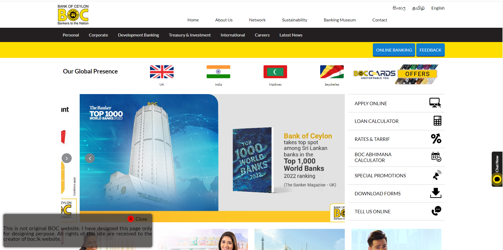
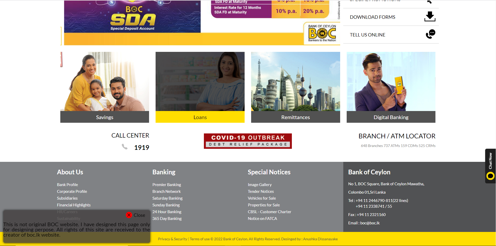

# About The Project

This pure HTML and CSS project is a clone website of the Bank of Ceylon ([BOC](https://www.boc.lk/)) in Srilanka. The clone website has been designed completely with pure HTML and CSS to practice and improve my web design skills. The whole design layout and images are copyrighted to their respective owners.
To visit boc-clone [click here.](https://anushkadissanayake.github.io/boc-clone/)


## Screenshots



<hr>



<hr>


## Built With

- [HTML5 ](https://developer.mozilla.org/en-US/docs/Glossary/HTML5)
- [CSS3 ](https://developer.mozilla.org/en-US/docs/Web/CSS)
    - Animations
    - Transitions
    - Transformations
    - Shadow Effect


## How to Use This Repository

Anyone who want to clone project use following command or [direct downlod](https://github.com/AnushkaDissanayake/boc-clone/archive/refs/heads/main.zip) zip file.

```bash
  git clone https://github.com/AnushkaDissanayake/boc-clone.git
```
    
## License

[MIT]()


## 🚀 About Me
I'm a full stack developer...


## 🔗 Links
[](https://www.linkedin.com/in/anushka-madusanka-disanayaka-294660170/)
